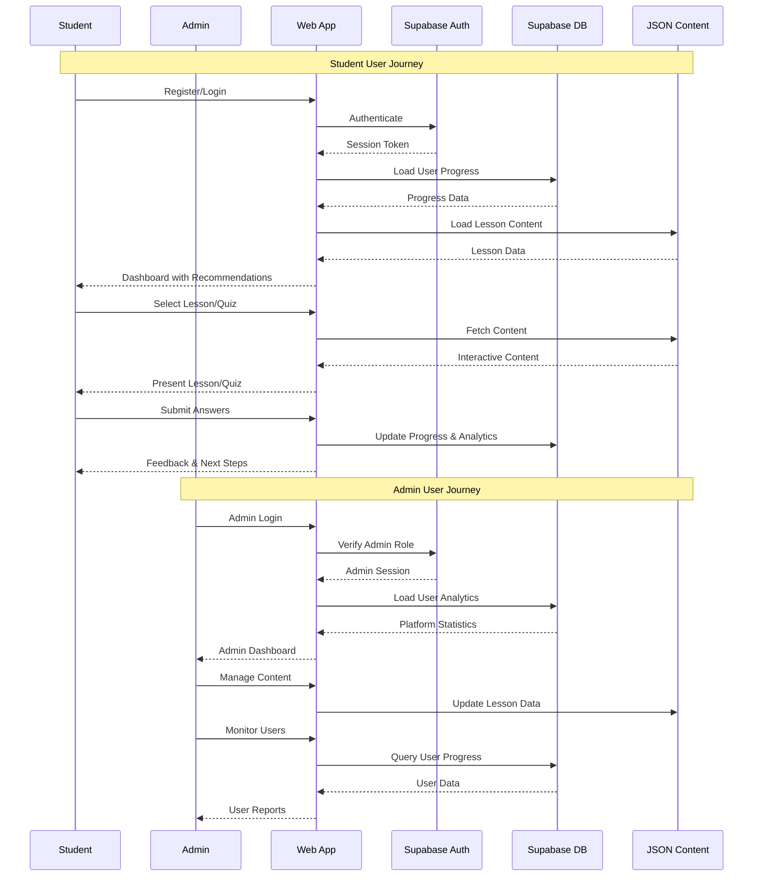
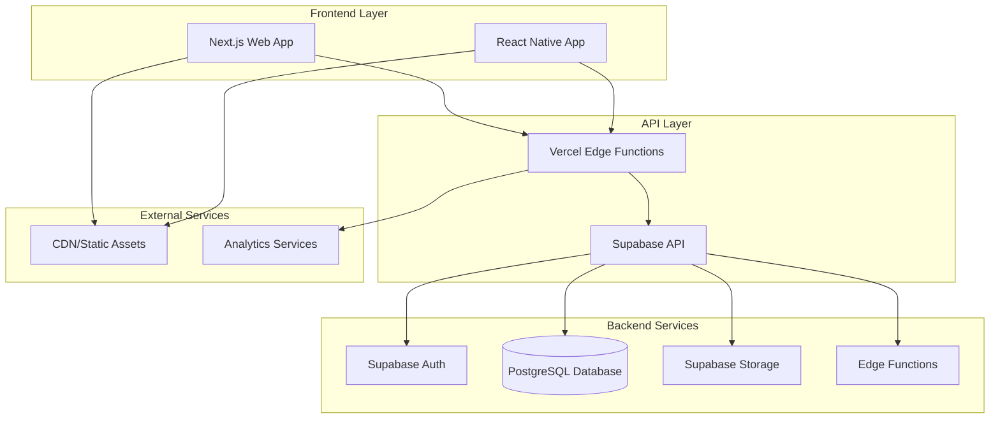
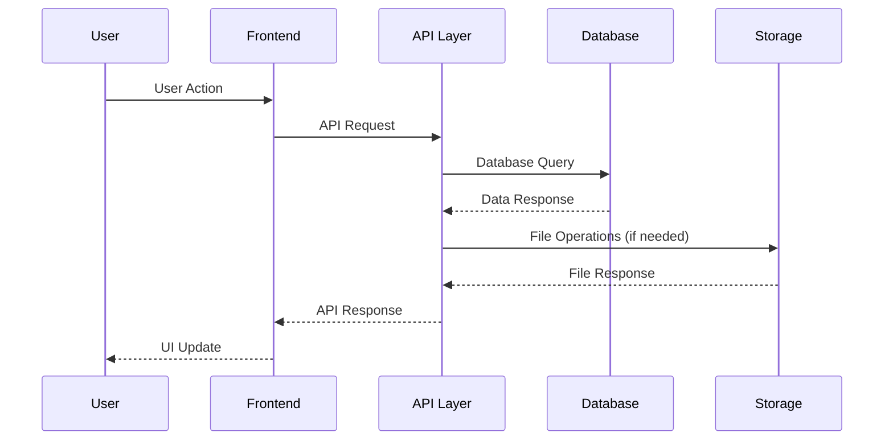
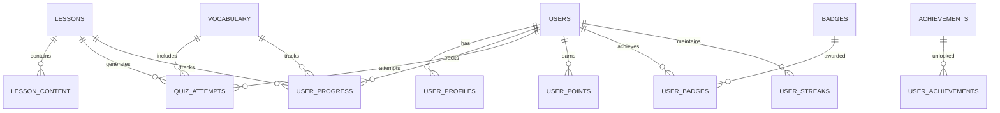

# Requirements Document - Online Oudgrieks Leerplatform

## Project Overview

Het **Online Oudgrieks Leerplatform** is een interactieve webapplicatie die jongeren vanaf 12 jaar helpt bij het leren van het Oudgrieks. Het platform combineert moderne gamification technieken met adaptief leren om een boeiende en effectieve leerervaring te bieden.

**Visie:** Het toegankelijk maken van Oudgrieks leren voor een nieuwe generatie door middel van interactieve technologie en bewezen pedagogische methoden.

**Doelstelling:** Een complete online leeromgeving creëren die gebruikers van beginner tot gevorderd niveau begeleidt in het beheersen van het Oudgrieks alfabet, vocabulaire, grammatica en vertaalvaardigheden.

## Doelgroep en Gebruikers

### Primaire Doelgroep
- **Leeftijd:** 12+ jaar
- **Niveau:** Beginners tot gevorderden
- **Achtergrond:** Geïnteresseerd in klassieke talen, geschiedenis, of literatuur
- **Technologie:** Comfortabel met moderne webapplicaties

### Gebruikerspersona's

#### 1. De Gemotiveerde Scholier (12-16 jaar)
- **Doel:** Oudgrieks leren voor school of persoonlijke interesse
- **Behoeften:** Interactieve lessen, duidelijke voortgang, beloningen
- **Uitdagingen:** Concentratie behouden, complexe grammatica begrijpen

#### 2. De Volwassen Leerling (17+ jaar)
- **Doel:** Oudgrieks leren voor universiteit, werk, of persoonlijke ontwikkeling
- **Behoeften:** Diepgaande uitleg, flexibele planning, certificering
- **Uitdagingen:** Tijd vinden, complexe concepten beheersen

#### 3. De Docent/Begeleider
- **Doel:** Studenten begeleiden en voortgang monitoren
- **Behoeften:** Overzicht van studentvoortgang, lesmateriaal, rapportage
- **Uitdagingen:** Verschillende niveaus beheren, effectiviteit meten

## Leerdoelen

### Alfabet en Uitspraak
- [ ] Grieks alfabet herkennen en uitspreken (24 letters)
- [ ] Hoofdletters en kleine letters onderscheiden
- [ ] Diakritische tekens begrijpen (accenten, spiritus)
- [ ] Correcte uitspraak van Griekse woorden

### Vocabulaire
- [ ] Basiswoordenschat van 500+ woorden
- [ ] Woordfamilies en etymologie begrijpen
- [ ] Frequentie-gebaseerde woordselectie
- [ ] Spaced repetition voor langetermijnretentie

### Grammatica
- [ ] Naamvallen (nominatief, genitief, datief, accusatief, vocatief)
- [ ] Werkwoordsvervoegingen (present, imperfect, aorist, perfect)
- [ ] Zelfstandige naamwoorden en bijvoeglijke naamwoorden
- [ ] Voornaamwoorden en lidwoorden
- [ ] Zinsbouw en syntaxis

### Lezen en Vertalen
- [ ] Eenvoudige Griekse teksten lezen
- [ ] Basisvertalingen maken
- [ ] Contextuele betekenis afleiden
- [ ] Klassieke teksten interpreteren

## Kernprincipes

### 1. Interactiviteit en Gamification
- **Principe:** Leren door doen en spelen
- **Implementatie:** Quizzen, beloningen, levels, achievements
- **Doel:** Motivatie en betrokkenheid verhogen

### 2. Toegankelijkheid (WCAG 2.1 AA)
- **Principe:** Inclusief design voor alle gebruikers
- **Implementatie:** Screen reader support, keyboard navigation, kleurcontrast
- **Doel:** Universele toegankelijkheid garanderen

### 3. Eenvoud en Gebruiksvriendelijkheid
- **Principe:** Intuïtieve interface zonder complexiteit
- **Implementatie:** Duidelijke navigatie, minimale clicks, duidelijke feedback
- **Doel:** Leercurve minimaliseren

### 4. Adaptief Leren
- **Principe:** Personalisatie op basis van voortgang en voorkeuren
- **Implementatie:** AI-gestuurde aanbevelingen, adaptieve moeilijkheidsgraad
- **Doel:** Optimale leerervaring voor elke gebruiker

### 5. Schaalbaarheid en Prestaties
- **Principe:** Platform moet groeien met gebruikersaantal
- **Implementatie:** Cloud-native architectuur, caching, CDN
- **Doel:** Consistente prestaties bij schaal

### 6. Modern Design en UX
- **Principe:** Aantrekkelijke, moderne interface
- **Implementatie:** Responsive design, moderne UI componenten, animaties
- **Doel:** Visuele aantrekkelijkheid en gebruikerservaring

## User Journey Diagram



## Kernfeatures en Functionaliteiten

### 1. Authenticatie en Gebruikersbeheer

#### Gebruikersregistratie en Inloggen
- **Supabase Auth Integratie:** Veilige authenticatie via email/wachtwoord en sociale login opties
- **Rol-gebaseerde Toegang:** Onderscheid tussen student en admin rollen met verschillende rechten
- **Sessie Management:** Automatische sessie verlenging en veilige logout functionaliteit
- **Profiel Beheer:** Gebruikers kunnen persoonlijke gegevens, voorkeuren en leerdoelen instellen

#### Gebruikersrollen
- **Student:** Volledige toegang tot leercontent, voortgang tracking, en persoonlijke dashboard
- **Admin:** Content management, gebruiker monitoring, analytics dashboard, en platform beheer
- **Docent (toekomstig):** Beperkte admin rechten voor specifieke groepen studenten

### 2. Lesstructuur en Content Management

#### Niveau-gebaseerde Organisatie
- **Beginner Niveau:** Alfabet, basis vocabulaire (100 woorden), eenvoudige grammatica
- **Intermediate Niveau:** Uitgebreide vocabulaire (500+ woorden), complexe grammatica, basis vertalingen
- **Advanced Niveau:** Geavanceerde grammatica, klassieke teksten, complexe vertalingen

#### Module Structuur
- **Lessen:** Gestructureerde content met theorie, voorbeelden en oefeningen
- **Quizzen:** Adaptieve toetsen na elke les voor voortgangsverificatie
- **Games:** Interactieve elementen voor vocabulaire en grammatica oefening
- **Assessments:** Periodieke evaluaties voor niveau bepaling

#### JSON Content Systeem
- **Les Content:** Gestructureerde JSON bestanden voor lessen, theorie en uitleg
- **Vocabulaire Database:** JSON-gebaseerde woordenschat met vertalingen, uitspraak en voorbeelden
- **Grammatica Regels:** JSON structuur voor grammatica regels, vervoegingen en uitzonderingen
- **Quiz Vragen:** JSON templates voor verschillende vraagtypes en moeilijkheidsgraden

### 3. Adaptief Leren en Voortgangstracking

#### Intelligente Voortgangsanalyse
- **Zwakke Punten Identificatie:** AI-algoritme detecteert gebieden waar gebruiker moeite heeft
- **Spaced Repetition:** Automatische herhaling van moeilijke content op optimale intervallen
- **Moeilijkheidsgraad Aanpassing:** Dynamische aanpassing van content complexiteit op basis van prestaties
- **Leerpad Optimalisatie:** Persoonlijke aanbevelingen voor volgende stappen

#### Voortgangs Metrics
- **Sessie Tracking:** Tijd besteed, lessen voltooid, quiz scores
- **Leercurve Analyse:** Voortgang over tijd en identificatie van leerpatronen
- **Retentie Metingen:** Langetermijn geheugen van geleerde concepten
- **Gamification Data:** Punten, badges, levels en achievements

### 4. Interactieve Elementen

#### Quiz Types
- **Multiple Choice:** Klassieke meerkeuzevragen voor snelle verificatie
- **Fill-in-the-Blank:** Open vragen voor diepere begripstest
- **Matching Exercises:** Koppelen van Griekse woorden aan Nederlandse vertalingen
- **Audio Quizzes:** Uitspraak oefeningen met audio feedback
- **Drag-and-Drop:** Visuele grammatica oefeningen

#### Gamification Features
- **Punten Systeem:** Verdien punten voor voltooide lessen en correcte antwoorden
- **Badges en Achievements:** Beloningen voor specifieke prestaties en milestones
- **Level Systeem:** Voortgang door verschillende moeilijkheidsniveaus
- **Streaks:** Beloningen voor consistente dagelijkse oefening
- **Leaderboards:** Vriendelijke competitie tussen gebruikers (optioneel)

#### Mini-Games
- **Memory Cards:** Vocabulaire oefening met kaartspel mechaniek
- **Word Builder:** Constructie van Griekse woorden uit letters
- **Grammar Puzzle:** Visuele grammatica oefeningen met drag-and-drop
- **Translation Challenge:** Tijdgebonden vertaling oefeningen

### 5. Dashboard en Analytics

#### Student Dashboard
- **Voortgangs Overzicht:** Visuele weergave van voltooide lessen en huidige niveau
- **Aanbevelingen:** AI-gestuurde suggesties voor volgende lessen
- **Statistieken:** Persoonlijke prestaties, tijd besteed, en verbetering trends
- **Doelen Tracking:** Voortgang naar persoonlijke leerdoelen
- **Recent Activity:** Overzicht van recente activiteiten en prestaties

#### Admin Dashboard
- **Gebruiker Management:** Overzicht van alle gebruikers, hun voortgang en activiteit
- **Content Analytics:** Meest populaire lessen, moeilijke content, en gebruiker feedback
- **Platform Statistieken:** Algemene gebruik metrics, retentie, en engagement
- **Content Management:** Toevoegen, bewerken en beheren van lessen en quizzen
- **Rapportage:** Uitgebreide rapporten voor stakeholders en docenten

### 6. User Journeys

#### Student User Journey
1. **Registratie/Login:** Eenvoudige account aanmaak of inloggen
2. **Niveau Assessment:** Korte test om startniveau te bepalen
3. **Dashboard Onboarding:** Introductie tot platform features en interface
4. **Les Selectie:** Keuze uit aanbevolen lessen of vrije keuze
5. **Interactieve Les:** Theorie, voorbeelden en oefeningen doorlopen
6. **Quiz Voltooiing:** Toetsing van geleerde concepten
7. **Feedback en Voortgang:** Directe feedback en voortgangsupdate
8. **Volgende Stappen:** Aanbevelingen voor vervolgactiviteiten

#### Admin User Journey
1. **Admin Login:** Beveiligde toegang met admin rechten
2. **Dashboard Overzicht:** Snelle blik op platform status en metrics
3. **Gebruiker Monitoring:** Inzicht in individuele en groepsvoortgang
4. **Content Management:** Toevoegen of bewerken van lessen en quizzen
5. **Analytics Review:** Uitgebreide analyse van platform prestaties
6. **Rapportage:** Genereren van rapporten voor stakeholders

### 7. JSON Content Flow

#### Content Structuur
```json
{
  "lesson": {
    "id": "lesson_001",
    "title": "Grieks Alfabet - Basis",
    "level": "beginner",
    "theory": "Uitleg van het Griekse alfabet...",
    "examples": ["α", "β", "γ"],
    "exercises": [...],
    "vocabulary": [...],
    "grammar_rules": [...]
  }
}
```

#### Vocabulaire Database
```json
{
  "vocabulary": {
    "word": "ἀγάπη",
    "translation": "liefde",
    "pronunciation": "agápē",
    "part_of_speech": "noun",
    "level": "beginner",
    "examples": ["ἀγάπη τοῦ θεοῦ = liefde van God"]
  }
}
```

#### Quiz Templates
```json
{
  "quiz": {
    "type": "multiple_choice",
    "question": "Wat betekent het woord ἀγάπη?",
    "options": ["liefde", "vrijheid", "waarheid", "vrede"],
    "correct_answer": 0,
    "explanation": "ἀγάπη betekent liefde in het Grieks"
  }
}
```

## Technische Architectuur

### Frontend Architectuur

#### React/Next.js Stack
- **Framework:** Next.js 14+ met App Router voor optimale performance en SEO
- **UI Library:** React 18+ met moderne hooks en concurrent features
- **Styling:** Tailwind CSS voor consistente, responsive design
- **State Management:** Zustand voor globale state, React Context voor component state
- **TypeScript:** Volledige type safety voor betere developer experience en bug prevention

#### Component Architectuur
- **Atomic Design:** Atomen, moleculen, organismen en templates voor herbruikbare componenten
- **Custom Hooks:** Herbruikbare logica voor data fetching, form handling en business logic
- **Error Boundaries:** Graceful error handling en fallback UI's
- **Lazy Loading:** Code splitting per route en component voor optimale performance

#### Routing en Navigatie
- **App Router:** Next.js 14+ App Router voor moderne routing met layouts en loading states
- **Dynamic Routes:** [id] routes voor lessen, quizzen en gebruikersprofielen
- **Middleware:** Route protection en redirects voor authenticatie
- **Breadcrumbs:** Duidelijke navigatie voor complexe leerpaden

#### Responsive Design
- **Mobile-First:** Ontwikkeling start met mobile interface
- **Breakpoints:** sm (640px), md (768px), lg (1024px), xl (1280px), 2xl (1536px)
- **Touch Optimization:** Touch-friendly interface elementen en gestures
- **Progressive Enhancement:** Basis functionaliteit werkt zonder JavaScript

### Backend Services (Supabase)

#### Authenticatie Service
- **Supabase Auth:** Email/password, OAuth providers (Google, GitHub)
- **Row Level Security (RLS):** Database-level security policies
- **JWT Tokens:** Secure session management met refresh tokens
- **Multi-factor Authentication:** TOTP support voor verhoogde beveiliging

#### PostgreSQL Database
- **Schema Design:** Genormaliseerde database structuur voor gebruikers, lessen, voortgang
- **Real-time Subscriptions:** Live updates voor voortgang en notificaties
- **Full-text Search:** PostgreSQL full-text search voor content zoeken
- **Database Functions:** Stored procedures voor complexe queries en business logic

#### File Storage
- **Supabase Storage:** Veilige opslag van audio bestanden, afbeeldingen en documenten
- **CDN Integration:** Snelle content delivery via Supabase CDN
- **Image Optimization:** Automatische resizing en format conversie
- **Access Control:** Per-user en per-role toegang tot bestanden

#### Edge Functions
- **Serverless Functions:** Deno-based edge functions voor API endpoints
- **Custom Business Logic:** Complexe berekeningen en data processing
- **Third-party Integrations:** API calls naar externe services
- **Background Jobs:** Asynchrone taken voor analytics en notificaties

#### API Architectuur
- **RESTful API:** Supabase auto-generated REST API
- **GraphQL (optioneel):** Voor complexe data queries
- **Rate Limiting:** API rate limiting voor security en performance
- **Caching Strategy:** Redis caching voor veelgebruikte queries

### Deployment en Hosting

#### Frontend Deployment (Vercel)
- **Vercel Platform:** Optimale Next.js hosting met edge functions
- **Automatic Deployments:** GitHub integration voor CI/CD
- **Preview Deployments:** Branch-based preview environments
- **Performance Monitoring:** Vercel Analytics voor real-time metrics

#### Backend Deployment (Supabase Cloud)
- **Managed PostgreSQL:** Fully managed database met automatische backups
- **Global CDN:** Wereldwijde content delivery
- **Auto-scaling:** Automatische schaling op basis van gebruik
- **Monitoring:** Supabase Dashboard voor real-time monitoring

#### CI/CD Pipeline
- **GitHub Actions:** Automated testing, building en deployment
- **Environment Management:** Development, staging en production environments
- **Database Migrations:** Geautomatiseerde database schema updates
- **Security Scanning:** Automated security vulnerability scanning

#### Environment Configuration
- **Environment Variables:** Secure configuration management
- **Secrets Management:** Vercel en Supabase secrets voor API keys
- **Feature Flags:** Toggle features per environment
- **Configuration Validation:** Runtime validation van environment configuratie

### Mobile Strategie en React Native

#### React Native Setup
- **Expo Framework:** Snelle development en deployment
- **Shared Codebase:** 70%+ code sharing tussen web en mobile
- **Platform-specific Code:** Native modules voor platform-specifieke features
- **Hot Reload:** Snelle development cycle met live reloading

#### Shared Logic Architecture
- **Business Logic:** Shared TypeScript modules voor data processing
- **API Layer:** Identieke API calls tussen web en mobile
- **State Management:** Shared Zustand stores voor consistente state
- **Utilities:** Herbruikbare helper functions en validators

#### Navigation Verschillen
- **Web:** Next.js App Router met browser history
- **Mobile:** React Navigation met native stack navigation
- **Deep Linking:** URL handling voor mobile app links
- **Back Button:** Platform-specifieke back button handling

#### Platform-specifieke Optimalisaties
- **Touch Gestures:** Native touch handling voor mobile
- **Offline Support:** Local storage en sync voor mobile
- **Push Notifications:** Native push notification support
- **App Store:** iOS App Store en Google Play Store deployment

#### Deployment Strategie
- **Expo Application Services (EAS):** Build en deployment pipeline
- **Over-the-Air Updates:** Instant updates zonder app store approval
- **App Store Optimization:** Metadata en screenshots voor stores
- **Beta Testing:** TestFlight (iOS) en Internal Testing (Android)

### Architectuur Diagrammen

#### Systeem Architectuur


#### Data Flow Diagram


### Technische Beslissingen

#### Technology Choices Justificatie
- **Next.js:** Server-side rendering, optimalisatie, en developer experience
- **Supabase:** Rapid development, real-time features, en managed infrastructure
- **TypeScript:** Type safety, betere IDE support, en minder runtime errors
- **Tailwind CSS:** Rapid styling, consistent design system, en kleine bundle size

#### Schaalbaarheid Overwegingen
- **Database:** PostgreSQL kan miljoenen records aan met proper indexing
- **CDN:** Global content delivery voor snelle laadtijden wereldwijd
- **Caching:** Multi-layer caching strategy voor optimale performance
- **Microservices:** Edge functions voor modulaire backend services

#### Performance Optimalisaties
- **Code Splitting:** Lazy loading van routes en componenten
- **Image Optimization:** Next.js Image component met automatische optimalisatie
- **Bundle Analysis:** Webpack bundle analyzer voor size monitoring
- **Core Web Vitals:** LCP, FID, en CLS optimalisatie

#### Security Maatregelen
- **HTTPS Everywhere:** SSL/TLS voor alle communicatie
- **CORS Configuration:** Proper cross-origin resource sharing
- **Input Validation:** Server-side en client-side input sanitization
- **Rate Limiting:** API rate limiting tegen abuse
- **Security Headers:** CSP, HSTS, en andere security headers

#### Future-proofing Strategie
- **Modular Architecture:** Makkelijk uitbreidbare component structuur
- **API Versioning:** Backward compatibility voor API changes
- **Technology Updates:** Regular dependency updates en security patches
- **Monitoring:** Comprehensive logging en error tracking

### Development Workflow

#### Development Environment
- **Node.js 18+:** LTS versie voor stabiele development
- **pnpm:** Snelle package manager met efficient disk usage
- **VS Code:** Recommended IDE met TypeScript en Tailwind extensions
- **Docker (optioneel):** Containerized development environment

#### Code Organization
- **Monorepo Structure:** Shared packages tussen web en mobile
- **Feature-based Folders:** Organisatie per feature in plaats van file type
- **Shared Components:** Herbruikbare UI componenten in shared package
- **Type Definitions:** Centralized TypeScript types en interfaces

#### Testing Strategie
- **Unit Tests:** Jest en React Testing Library voor component tests
- **Integration Tests:** API endpoint testing met Supertest
- **E2E Tests:** Playwright voor end-to-end user journey tests
- **Visual Regression:** Chromatic voor UI component testing

#### Version Control Workflow
- **Git Flow:** Feature branches met pull request reviews
- **Conventional Commits:** Gestandaardiseerde commit messages
- **Automated Testing:** CI pipeline met automated test execution
- **Code Quality:** ESLint, Prettier, en Husky pre-commit hooks

#### Team Collaboration
- **Documentation:** Comprehensive README en API documentation
- **Code Reviews:** Mandatory peer review voor alle changes
- **Pair Programming:** Collaborative development voor complex features
- **Knowledge Sharing:** Regular tech talks en documentation updates

## Database Schema en Data Model

### Database Schema Overzicht

Het platform gebruikt een PostgreSQL database via Supabase met een genormaliseerde structuur die gebruikers, voortgang, content en gamification data efficiënt beheert. De database is ontworpen voor schaalbaarheid, performance en data integriteit met Row Level Security (RLS) policies voor veilige toegang.

#### Hoofdtabellen Relaties


### Core Tables

#### 1. Users Table
```sql
CREATE TABLE users (
    id UUID PRIMARY KEY DEFAULT gen_random_uuid(),
    email VARCHAR(255) UNIQUE NOT NULL,
    role VARCHAR(20) NOT NULL DEFAULT 'student' CHECK (role IN ('student', 'admin', 'docent')),
    created_at TIMESTAMP WITH TIME ZONE DEFAULT NOW(),
    updated_at TIMESTAMP WITH TIME ZONE DEFAULT NOW(),
    last_login TIMESTAMP WITH TIME ZONE,
    is_active BOOLEAN DEFAULT true,
    email_verified BOOLEAN DEFAULT false
);
```

#### 2. User Profiles Table
```sql
CREATE TABLE user_profiles (
    id UUID PRIMARY KEY DEFAULT gen_random_uuid(),
    user_id UUID REFERENCES users(id) ON DELETE CASCADE,
    first_name VARCHAR(100),
    last_name VARCHAR(100),
    preferred_language VARCHAR(10) DEFAULT 'nl',
    timezone VARCHAR(50) DEFAULT 'Europe/Amsterdam',
    learning_goals TEXT[],
    current_level VARCHAR(20) DEFAULT 'beginner' CHECK (current_level IN ('beginner', 'intermediate', 'advanced')),
    daily_goal_minutes INTEGER DEFAULT 30,
    notification_preferences JSONB DEFAULT '{"email": true, "push": true, "reminders": true}',
    created_at TIMESTAMP WITH TIME ZONE DEFAULT NOW(),
    updated_at TIMESTAMP WITH TIME ZONE DEFAULT NOW()
);
```

#### 3. User Progress Table
```sql
CREATE TABLE user_progress (
    id UUID PRIMARY KEY DEFAULT gen_random_uuid(),
    user_id UUID REFERENCES users(id) ON DELETE CASCADE,
    lesson_id UUID REFERENCES lessons(id) ON DELETE CASCADE,
    vocabulary_id UUID REFERENCES vocabulary(id) ON DELETE CASCADE,
    progress_type VARCHAR(20) NOT NULL CHECK (progress_type IN ('lesson', 'vocabulary', 'quiz', 'game')),
    completion_percentage DECIMAL(5,2) DEFAULT 0.00,
    time_spent_seconds INTEGER DEFAULT 0,
    attempts_count INTEGER DEFAULT 0,
    last_attempted TIMESTAMP WITH TIME ZONE DEFAULT NOW(),
    completed_at TIMESTAMP WITH TIME ZONE,
    mastery_level INTEGER DEFAULT 0 CHECK (mastery_level BETWEEN 0 AND 5),
    difficulty_rating INTEGER DEFAULT 1 CHECK (difficulty_rating BETWEEN 1 AND 5),
    created_at TIMESTAMP WITH TIME ZONE DEFAULT NOW(),
    updated_at TIMESTAMP WITH TIME ZONE DEFAULT NOW()
);
```

#### 4. Lessons Table
```sql
CREATE TABLE lessons (
    id UUID PRIMARY KEY DEFAULT gen_random_uuid(),
    title VARCHAR(255) NOT NULL,
    description TEXT,
    level VARCHAR(20) NOT NULL CHECK (level IN ('beginner', 'intermediate', 'advanced')),
    category VARCHAR(50) NOT NULL CHECK (category IN ('alphabet', 'vocabulary', 'grammar', 'translation', 'reading')),
    order_index INTEGER NOT NULL,
    estimated_duration_minutes INTEGER DEFAULT 30,
    prerequisites UUID[] DEFAULT '{}',
    learning_objectives TEXT[],
    is_published BOOLEAN DEFAULT false,
    created_by UUID REFERENCES users(id),
    created_at TIMESTAMP WITH TIME ZONE DEFAULT NOW(),
    updated_at TIMESTAMP WITH TIME ZONE DEFAULT NOW()
);
```

#### 5. Lesson Content Table
```sql
CREATE TABLE lesson_content (
    id UUID PRIMARY KEY DEFAULT gen_random_uuid(),
    lesson_id UUID REFERENCES lessons(id) ON DELETE CASCADE,
    content_type VARCHAR(20) NOT NULL CHECK (content_type IN ('theory', 'example', 'exercise', 'quiz', 'game')),
    content_data JSONB NOT NULL,
    order_index INTEGER NOT NULL,
    is_required BOOLEAN DEFAULT true,
    created_at TIMESTAMP WITH TIME ZONE DEFAULT NOW(),
    updated_at TIMESTAMP WITH TIME ZONE DEFAULT NOW()
);
```

#### 6. Vocabulary Table
```sql
CREATE TABLE vocabulary (
    id UUID PRIMARY KEY DEFAULT gen_random_uuid(),
    greek_word VARCHAR(255) NOT NULL,
    dutch_translation VARCHAR(255) NOT NULL,
    pronunciation VARCHAR(255),
    part_of_speech VARCHAR(20) CHECK (part_of_speech IN ('noun', 'verb', 'adjective', 'adverb', 'preposition', 'conjunction', 'article')),
    level VARCHAR(20) NOT NULL CHECK (level IN ('beginner', 'intermediate', 'advanced')),
    frequency_rank INTEGER,
    examples JSONB DEFAULT '[]',
    etymology TEXT,
    related_words UUID[] DEFAULT '{}',
    audio_file_url VARCHAR(500),
    created_at TIMESTAMP WITH TIME ZONE DEFAULT NOW(),
    updated_at TIMESTAMP WITH TIME ZONE DEFAULT NOW()
);
```

#### 7. Quiz Attempts Table
```sql
CREATE TABLE quiz_attempts (
    id UUID PRIMARY KEY DEFAULT gen_random_uuid(),
    user_id UUID REFERENCES users(id) ON DELETE CASCADE,
    lesson_id UUID REFERENCES lessons(id) ON DELETE CASCADE,
    quiz_type VARCHAR(20) NOT NULL CHECK (quiz_type IN ('multiple_choice', 'fill_blank', 'matching', 'audio', 'drag_drop')),
    questions_data JSONB NOT NULL,
    answers_data JSONB NOT NULL,
    score_percentage DECIMAL(5,2) NOT NULL,
    time_spent_seconds INTEGER NOT NULL,
    is_completed BOOLEAN DEFAULT false,
    feedback_data JSONB DEFAULT '{}',
    created_at TIMESTAMP WITH TIME ZONE DEFAULT NOW()
);
```

#### 8. Gamification Tables

##### User Points Table
```sql
CREATE TABLE user_points (
    id UUID PRIMARY KEY DEFAULT gen_random_uuid(),
    user_id UUID REFERENCES users(id) ON DELETE CASCADE,
    points INTEGER NOT NULL DEFAULT 0,
    points_source VARCHAR(50) NOT NULL CHECK (points_source IN ('lesson_completion', 'quiz_correct', 'streak_bonus', 'achievement', 'daily_login')),
    source_id UUID,
    created_at TIMESTAMP WITH TIME ZONE DEFAULT NOW()
);
```

##### Badges Table
```sql
CREATE TABLE badges (
    id UUID PRIMARY KEY DEFAULT gen_random_uuid(),
    name VARCHAR(100) NOT NULL,
    description TEXT NOT NULL,
    icon_url VARCHAR(500),
    category VARCHAR(20) CHECK (category IN ('learning', 'streak', 'achievement', 'special')),
    requirements JSONB NOT NULL,
    points_value INTEGER DEFAULT 0,
    is_active BOOLEAN DEFAULT true,
    created_at TIMESTAMP WITH TIME ZONE DEFAULT NOW()
);
```

##### User Badges Table
```sql
CREATE TABLE user_badges (
    id UUID PRIMARY KEY DEFAULT gen_random_uuid(),
    user_id UUID REFERENCES users(id) ON DELETE CASCADE,
    badge_id UUID REFERENCES badges(id) ON DELETE CASCADE,
    earned_at TIMESTAMP WITH TIME ZONE DEFAULT NOW(),
    UNIQUE(user_id, badge_id)
);
```

##### Achievements Table
```sql
CREATE TABLE achievements (
    id UUID PRIMARY KEY DEFAULT gen_random_uuid(),
    name VARCHAR(100) NOT NULL,
    description TEXT NOT NULL,
    icon_url VARCHAR(500),
    category VARCHAR(20) CHECK (category IN ('learning', 'streak', 'milestone', 'special')),
    requirements JSONB NOT NULL,
    points_value INTEGER DEFAULT 0,
    is_active BOOLEAN DEFAULT true,
    created_at TIMESTAMP WITH TIME ZONE DEFAULT NOW()
);
```

##### User Achievements Table
```sql
CREATE TABLE user_achievements (
    id UUID PRIMARY KEY DEFAULT gen_random_uuid(),
    user_id UUID REFERENCES users(id) ON DELETE CASCADE,
    achievement_id UUID REFERENCES achievements(id) ON DELETE CASCADE,
    unlocked_at TIMESTAMP WITH TIME ZONE DEFAULT NOW(),
    UNIQUE(user_id, achievement_id)
);
```

##### User Streaks Table
```sql
CREATE TABLE user_streaks (
    id UUID PRIMARY KEY DEFAULT gen_random_uuid(),
    user_id UUID REFERENCES users(id) ON DELETE CASCADE,
    streak_type VARCHAR(20) NOT NULL CHECK (streak_type IN ('daily_login', 'daily_lessons', 'weekly_goals')),
    current_streak INTEGER DEFAULT 0,
    longest_streak INTEGER DEFAULT 0,
    last_activity_date DATE,
    created_at TIMESTAMP WITH TIME ZONE DEFAULT NOW(),
    updated_at TIMESTAMP WITH TIME ZONE DEFAULT NOW(),
    UNIQUE(user_id, streak_type)
);
```

### Supabase Row Level Security (RLS) Policies

#### Student Access Policies
```sql
-- Students kunnen alleen hun eigen data bekijken
CREATE POLICY "Students can view own profile" ON user_profiles
    FOR SELECT USING (auth.uid() = user_id);

CREATE POLICY "Students can update own profile" ON user_profiles
    FOR UPDATE USING (auth.uid() = user_id);

CREATE POLICY "Students can view own progress" ON user_progress
    FOR SELECT USING (auth.uid() = user_id);

CREATE POLICY "Students can insert own progress" ON user_progress
    FOR INSERT WITH CHECK (auth.uid() = user_id);

CREATE POLICY "Students can update own progress" ON user_progress
    FOR UPDATE USING (auth.uid() = user_id);

-- Level-gated lesson access - students can only access lessons based on their progress
CREATE POLICY "Students can view lessons based on level and progress" ON lessons
    FOR SELECT USING (
        is_published = true AND
        (level = 'beginner' OR 
         (level = 'intermediate' AND EXISTS (
             SELECT 1 FROM user_progress 
             WHERE user_progress.user_id = auth.uid() 
             AND user_progress.progress_type = 'lesson'
             AND user_progress.completion_percentage >= 80
         )) OR
         (level = 'advanced' AND EXISTS (
             SELECT 1 FROM user_progress 
             WHERE user_progress.user_id = auth.uid() 
             AND user_progress.progress_type = 'lesson'
             AND user_progress.completion_percentage >= 80
             AND user_progress.mastery_level >= 3
         ))
        )
    );

CREATE POLICY "Students can view lesson content based on level and progress" ON lesson_content
    FOR SELECT USING (
        EXISTS (
            SELECT 1 FROM lessons 
            WHERE lessons.id = lesson_content.lesson_id 
            AND lessons.is_published = true
            AND (lessons.level = 'beginner' OR 
                 (lessons.level = 'intermediate' AND EXISTS (
                     SELECT 1 FROM user_progress 
                     WHERE user_progress.user_id = auth.uid() 
                     AND user_progress.progress_type = 'lesson'
                     AND user_progress.completion_percentage >= 80
                 )) OR
                 (lessons.level = 'advanced' AND EXISTS (
                     SELECT 1 FROM user_progress 
                     WHERE user_progress.user_id = auth.uid() 
                     AND user_progress.progress_type = 'lesson'
                     AND user_progress.completion_percentage >= 80
                     AND user_progress.mastery_level >= 3
                 ))
            )
        )
    );

CREATE POLICY "Students can view vocabulary" ON vocabulary
    FOR SELECT USING (true);

CREATE POLICY "Students can view own quiz attempts" ON quiz_attempts
    FOR SELECT USING (auth.uid() = user_id);

CREATE POLICY "Students can insert own quiz attempts" ON quiz_attempts
    FOR INSERT WITH CHECK (auth.uid() = user_id);
```

#### Admin Access Policies
```sql
-- Admins hebben volledige toegang
CREATE POLICY "Admins have full access to users" ON users
    FOR ALL USING (
        EXISTS (
            SELECT 1 FROM users 
            WHERE users.id = auth.uid() 
            AND users.role = 'admin'
        )
    );

CREATE POLICY "Admins have full access to user_profiles" ON user_profiles
    FOR ALL USING (
        EXISTS (
            SELECT 1 FROM users 
            WHERE users.id = auth.uid() 
            AND users.role = 'admin'
        )
    );

CREATE POLICY "Admins have full access to lessons" ON lessons
    FOR ALL USING (
        EXISTS (
            SELECT 1 FROM users 
            WHERE users.id = auth.uid() 
            AND users.role = 'admin'
        )
    );

CREATE POLICY "Admins have full access to lesson_content" ON lesson_content
    FOR ALL USING (
        EXISTS (
            SELECT 1 FROM users 
            WHERE users.id = auth.uid() 
            AND users.role = 'admin'
        )
    );

CREATE POLICY "Admins have full access to user_progress" ON user_progress
    FOR ALL USING (
        EXISTS (
            SELECT 1 FROM users 
            WHERE users.id = auth.uid() 
            AND users.role = 'admin'
        )
    );

CREATE POLICY "Admins have full access to quiz_attempts" ON quiz_attempts
    FOR ALL USING (
        EXISTS (
            SELECT 1 FROM users 
            WHERE users.id = auth.uid() 
            AND users.role = 'admin'
        )
    );

CREATE POLICY "Admins have full access to vocabulary" ON vocabulary
    FOR ALL USING (
        EXISTS (
            SELECT 1 FROM users 
            WHERE users.id = auth.uid() 
            AND users.role = 'admin'
        )
    );

CREATE POLICY "Admins have full access to user_points" ON user_points
    FOR ALL USING (
        EXISTS (
            SELECT 1 FROM users 
            WHERE users.id = auth.uid() 
            AND users.role = 'admin'
        )
    );

CREATE POLICY "Admins have full access to user_badges" ON user_badges
    FOR ALL USING (
        EXISTS (
            SELECT 1 FROM users 
            WHERE users.id = auth.uid() 
            AND users.role = 'admin'
        )
    );

CREATE POLICY "Admins have full access to user_achievements" ON user_achievements
    FOR ALL USING (
        EXISTS (
            SELECT 1 FROM users 
            WHERE users.id = auth.uid() 
            AND users.role = 'admin'
        )
    );

CREATE POLICY "Admins have full access to user_streaks" ON user_streaks
    FOR ALL USING (
        EXISTS (
            SELECT 1 FROM users 
            WHERE users.id = auth.uid() 
            AND users.role = 'admin'
        )
    );
```


### JSON Content Storage Strategie

#### Content Versioning en Schema Management
- **Semantic Versioning:** JSON content gebruikt semver (major.minor.patch) voor backward compatibility
- **Schema Validation:** JSON Schema validatie voor alle content types om data integriteit te garanderen
- **Migration Scripts:** Geautomatiseerde migratie scripts voor schema updates zonder data verlies
- **Rollback Capability:** Instant rollback naar vorige content versies bij problemen
- **A/B Testing Support:** Content varianten voor experimentele features en optimalisatie

#### Moderation en Review Workflows
- **Content Approval Pipeline:** Multi-stage review proces voor nieuwe content (draft → review → approved → published)
- **Version Control:** Git-like versie tracking voor content changes met diff visualisatie
- **Collaborative Editing:** Real-time collaborative editing voor content creators
- **Review Comments:** Inline feedback systeem voor content reviewers
- **Publishing Gates:** Automatische checks voor content kwaliteit en compliance

#### JSONB Performance en Indexing
- **GIN Indexes:** Generalized Inverted Indexes voor JSONB queries en full-text search
- **Partial Indexes:** Geoptimaliseerde indexes voor specifieke JSON paths en conditions
- **Query Optimization:** Prepared statements en query caching voor veelgebruikte JSON queries
- **Compression:** JSONB compressie voor storage optimalisatie zonder performance impact
- **Materialized Views:** Pre-computed views voor complexe JSON aggregaties

#### Schema Evolution en Migration Strategieën
- **Backward Compatibility:** Nieuwe schema versies blijven compatibel met bestaande data
- **Gradual Migration:** Incrementele migratie van content naar nieuwe schema versies
- **Data Transformation:** Automatische data transformatie tussen schema versies
- **Validation Rules:** Runtime validatie van JSON content tegen schema definities
- **Error Handling:** Graceful degradation bij schema mismatches of corrupte data

#### Lesson Content Structure
```json
{
  "lesson_content": {
    "theory": {
      "title": "Grieks Alfabet - Basis",
      "content": "Het Griekse alfabet bestaat uit 24 letters...",
      "media": {
        "images": ["alphabet-chart.png"],
        "audio": ["pronunciation-guide.mp3"],
        "videos": ["alphabet-intro.mp4"]
      }
    },
    "examples": [
      {
        "greek": "α",
        "dutch": "alfa",
        "pronunciation": "a",
        "description": "Eerste letter van het Griekse alfabet"
      }
    ],
    "exercises": [
      {
        "type": "multiple_choice",
        "question": "Wat is de eerste letter van het Griekse alfabet?",
        "options": ["α", "β", "γ", "δ"],
        "correct_answer": 0,
        "explanation": "α (alfa) is de eerste letter"
      }
    ]
  }
}
```

#### Vocabulary Database Schema
```json
{
  "vocabulary_entry": {
    "greek_word": "ἀγάπη",
    "dutch_translation": "liefde",
    "pronunciation": "agápē",
    "part_of_speech": "noun",
    "level": "beginner",
    "frequency_rank": 15,
    "examples": [
      {
        "greek": "ἀγάπη τοῦ θεοῦ",
        "dutch": "liefde van God",
        "context": "religieus"
      }
    ],
    "etymology": "Van ἀγαπάω (agapáō) - houden van",
    "related_words": ["φιλία", "ἔρως"],
    "audio_file_url": "/audio/agape.mp3"
  }
}
```

#### Quiz Templates
```json
{
  "quiz_template": {
    "type": "multiple_choice",
    "question": "Wat betekent het woord ἀγάπη?",
    "options": ["liefde", "vrijheid", "waarheid", "vrede"],
    "correct_answer": 0,
    "explanation": "ἀγάπη betekent liefde in het Grieks",
    "difficulty": "beginner",
    "time_limit_seconds": 30,
    "points": 10
  }
}
```

### Database Relationships en Constraints

#### Foreign Key Constraints
```sql
-- User relationships
ALTER TABLE user_profiles ADD CONSTRAINT fk_user_profiles_user_id 
    FOREIGN KEY (user_id) REFERENCES users(id) ON DELETE CASCADE;

-- Progress relationships
ALTER TABLE user_progress ADD CONSTRAINT fk_user_progress_user_id 
    FOREIGN KEY (user_id) REFERENCES users(id) ON DELETE CASCADE;
ALTER TABLE user_progress ADD CONSTRAINT fk_user_progress_lesson_id 
    FOREIGN KEY (lesson_id) REFERENCES lessons(id) ON DELETE CASCADE;
ALTER TABLE user_progress ADD CONSTRAINT fk_user_progress_vocabulary_id 
    FOREIGN KEY (vocabulary_id) REFERENCES vocabulary(id) ON DELETE CASCADE;

-- Content relationships
ALTER TABLE lesson_content ADD CONSTRAINT fk_lesson_content_lesson_id 
    FOREIGN KEY (lesson_id) REFERENCES lessons(id) ON DELETE CASCADE;

-- Quiz relationships
ALTER TABLE quiz_attempts ADD CONSTRAINT fk_quiz_attempts_user_id 
    FOREIGN KEY (user_id) REFERENCES users(id) ON DELETE CASCADE;
ALTER TABLE quiz_attempts ADD CONSTRAINT fk_quiz_attempts_lesson_id 
    FOREIGN KEY (lesson_id) REFERENCES lessons(id) ON DELETE CASCADE;

-- Gamification relationships
ALTER TABLE user_points ADD CONSTRAINT fk_user_points_user_id 
    FOREIGN KEY (user_id) REFERENCES users(id) ON DELETE CASCADE;
ALTER TABLE user_badges ADD CONSTRAINT fk_user_badges_user_id 
    FOREIGN KEY (user_id) REFERENCES users(id) ON DELETE CASCADE;
ALTER TABLE user_badges ADD CONSTRAINT fk_user_badges_badge_id 
    FOREIGN KEY (badge_id) REFERENCES badges(id) ON DELETE CASCADE;
```

#### Indexes voor Performance
```sql
-- User performance indexes
CREATE INDEX idx_user_progress_user_id ON user_progress(user_id);
CREATE INDEX idx_user_progress_lesson_id ON user_progress(lesson_id);
CREATE INDEX idx_user_progress_completion ON user_progress(completion_percentage);
CREATE INDEX idx_user_progress_created_at ON user_progress(created_at);

-- Lesson performance indexes
CREATE INDEX idx_lessons_level ON lessons(level);
CREATE INDEX idx_lessons_category ON lessons(category);
CREATE INDEX idx_lessons_published ON lessons(is_published);
CREATE INDEX idx_lesson_content_lesson_id ON lesson_content(lesson_id);

-- Vocabulary performance indexes
CREATE INDEX idx_vocabulary_level ON vocabulary(level);
CREATE INDEX idx_vocabulary_part_of_speech ON vocabulary(part_of_speech);
CREATE INDEX idx_vocabulary_frequency ON vocabulary(frequency_rank);

-- Quiz performance indexes
CREATE INDEX idx_quiz_attempts_user_id ON quiz_attempts(user_id);
CREATE INDEX idx_quiz_attempts_lesson_id ON quiz_attempts(lesson_id);
CREATE INDEX idx_quiz_attempts_created_at ON quiz_attempts(created_at);

-- Gamification indexes
CREATE INDEX idx_user_points_user_id ON user_points(user_id);
CREATE INDEX idx_user_points_created_at ON user_points(created_at);
CREATE INDEX idx_user_streaks_user_id ON user_streaks(user_id);
CREATE INDEX idx_user_streaks_type ON user_streaks(streak_type);
```

### Schaalbaarheid Overwegingen

#### Database Partitioning Strategie
- **User Progress Partitioning:** Partitioneren op user_id voor betere query performance
- **Quiz Attempts Partitioning:** Maandelijkse partities voor historische data
- **Time-based Partitioning:** Automatische archivering van oude data

#### Read Replicas voor Performance
- **Analytics Replica:** Gespecialiseerde replica voor reporting queries
- **Content Replica:** Read-only replica voor lesson content delivery
- **Geographic Distribution:** Replica's in verschillende regio's voor lage latency

#### Caching Strategieën
- **Redis Caching:** Frequently accessed lesson content en user progress
- **CDN Caching:** Static assets en JSON content files
- **Application-level Caching:** User session data en preferences

#### Archive Strategieën
- **Cold Storage:** Oude quiz attempts en progress data naar S3
- **Data Retention:** Automatische cleanup van oude log data
- **Backup Strategy:** Dagelijkse backups met 30-dagen retentie

#### Multi-tenant Overwegingen
- **Tenant Isolation:** Row-level security per tenant/organisatie
- **Resource Quotas:** Per-tenant resource limits en monitoring
- **Custom Content:** Tenant-specifieke lesson content en branding

### Data Migration en Backup Strategie

#### Database Migrations
- **Version Control:** Alle schema changes in Git met versie tracking
- **Rollback Strategy:** Automatische rollback bij failed migrations
- **Zero-downtime:** Blue-green deployment voor production updates

#### Backup Policies
- **Daily Backups:** Volledige database backup elke dag
- **Point-in-time Recovery:** WAL-based recovery voor data consistency
- **Cross-region Backup:** Backup replicatie naar verschillende regio's

#### Disaster Recovery
- **RTO (Recovery Time Objective):** < 4 uur voor volledige recovery
- **RPO (Recovery Point Objective):** < 1 uur data loss maximum
- **Testing:** Maandelijkse disaster recovery tests

## UI/UX Design en Toegankelijkheid

### Responsive en Mobile-First Design Strategie

#### Mobile-First Approach
- **Basis Functionaliteit:** Alle core features werken perfect op mobile devices
- **Touch-First Interface:** 44px minimum touch targets voor vingers en stylus
- **Gesture Support:** Swipe, pinch-to-zoom, en pull-to-refresh waar relevant
- **Thumb-Friendly Navigation:** Belangrijke acties binnen bereik van duim
- **Orientation Support:** Optimale ervaring in zowel portrait als landscape mode

#### Breakpoint Strategie
- **Mobile:** 320px - 767px (sm) - Primary focus voor development
- **Tablet:** 768px - 1023px (md) - Enhanced layout met meer ruimte
- **Desktop:** 1024px - 1279px (lg) - Full feature set met sidebar navigation
- **Large Desktop:** 1280px+ (xl) - Optimized voor grote schermen
- **Ultra-wide:** 1536px+ (2xl) - Maximum content width met centering

#### Progressive Enhancement
- **Core Content:** Alle leercontent toegankelijk zonder JavaScript
- **Enhanced Interactivity:** JavaScript voegt interactieve features toe
- **Graceful Degradation:** Fallbacks voor niet-ondersteunde features
- **Performance First:** Snelle laadtijden op alle devices en netwerkcondities

#### Cross-Device Consistency
- **Unified Experience:** Identieke functionaliteit op alle devices
- **Context-Aware Features:** Device-specifieke optimalisaties waar nodig
- **Sync Capabilities:** Voortgang en instellingen gesynchroniseerd tussen devices
- **Responsive Images:** Automatische optimalisatie voor verschillende schermgroottes

### WCAG 2.1 AA Toegankelijkheidsrichtlijnen

#### Keyboard Navigation
- **Tab Order:** Logische tab volgorde door alle interactieve elementen
- **Skip Links:** Directe toegang tot hoofdcontent en navigatie
- **Focus Indicators:** Duidelijke visuele focus states voor alle elementen
- **Keyboard Shortcuts:** Toegankelijke shortcuts voor veelgebruikte acties
- **Escape Handling:** Consistente escape gedrag voor modals en overlays

#### Screen Reader Support
- **Semantic HTML:** Correct gebruik van heading hierarchy (h1-h6)
- **ARIA Labels:** Beschrijvende labels voor complexe UI componenten
- **Live Regions:** Announcements voor dynamische content updates
- **Landmark Roles:** Navigation, main, complementary, en banner landmarks
- **Form Labels:** Geassocieerde labels voor alle form inputs

#### Color en Contrast
- **Contrast Ratio:** Minimum 4.5:1 voor normale tekst, 3:1 voor grote tekst
- **Color Independence:** Geen informatie uitsluitend via kleur overgebracht
- **High Contrast Mode:** Ondersteuning voor system high contrast instellingen
- **Color Blindness:** Testen met verschillende kleurenblindheid simulaties
- **Dark Mode:** Toegankelijke dark theme met voldoende contrast

#### Focus Management
- **Focus Trapping:** Focus blijft binnen modals en overlays
- **Focus Restoration:** Focus keert terug naar trigger element na sluiten
- **Visible Focus:** Duidelijke focus indicators op alle focusable elementen
- **Focus Order:** Intuïtieve focus flow door de interface
- **Focus Management:** Programmatische focus control voor complexe interacties

#### Semantic HTML en ARIA
- **Heading Structure:** Logische h1-h6 hierarchy zonder levels overslaan
- **List Markup:** Correcte ul/ol markup voor alle lijsten
- **Table Headers:** Proper th elements en scope attributes
- **Form Structure:** Fieldset en legend voor gerelateerde form controls
- **ARIA States:** aria-expanded, aria-selected, aria-hidden waar nodig

#### Accessibility Testing Procedures
- **Automated Testing:** axe-core integratie in CI/CD pipeline
- **Manual Testing:** Screen reader testing met NVDA, JAWS, en VoiceOver
- **Keyboard Testing:** Volledige functionaliteit testen zonder muis
- **Color Testing:** Contrast checker tools en kleurenblindheid simulaties
- **User Testing:** Testing met echte gebruikers met verschillende beperkingen

### Theming en Visual Design System

#### Design Token System
- **Color Tokens:** Consistente kleurpalet met semantische namen (primary, secondary, success, warning, error)
- **Typography Tokens:** Font families, sizes, weights, en line heights als herbruikbare tokens
- **Spacing Tokens:** Gestandaardiseerde spacing scale (4px, 8px, 16px, 24px, 32px, 48px, 64px)
- **Border Radius Tokens:** Consistente border radius values voor verschillende component sizes
- **Shadow Tokens:** Elevation system met verschillende shadow depths
- **Animation Tokens:** Gestandaardiseerde timing functions en durations

#### Color Palette
- **Primary Colors:** Grieks geïnspireerde kleuren (blauw, wit, goud accenten)
- **Semantic Colors:** Success (groen), warning (oranje), error (rood), info (blauw)
- **Neutral Colors:** Grijstinten voor tekst, borders, en backgrounds
- **Light Theme:** Hoog contrast voor dagelijks gebruik
- **Dark Theme:** Oog-vriendelijke donkere kleuren voor avondgebruik
- **High Contrast Theme:** Extra hoog contrast voor gebruikers met visuele beperkingen

#### Typography Scale
- **Font Families:** System fonts (Inter, -apple-system, BlinkMacSystemFont) voor performance
- **Heading Scale:** h1 (2.5rem), h2 (2rem), h3 (1.5rem), h4 (1.25rem), h5 (1.125rem), h6 (1rem)
- **Body Text:** 1rem (16px) base size met 1.5 line height
- **Small Text:** 0.875rem (14px) voor captions en secondary informatie
- **Large Text:** 1.125rem (18px) voor belangrijke content
- **Greek Text:** Speciale font voor Oudgriekse karakters met goede leesbaarheid

#### Spacing System
- **Base Unit:** 4px als fundamentele spacing unit
- **Scale:** 4px, 8px, 12px, 16px, 20px, 24px, 32px, 40px, 48px, 64px, 80px, 96px
- **Component Spacing:** Consistente padding en margins binnen componenten
- **Layout Spacing:** Gestandaardiseerde spacing tussen layout secties
- **Responsive Spacing:** Aangepaste spacing voor verschillende schermgroottes

#### Component Variants
- **Button Variants:** Primary, secondary, outline, ghost, link met verschillende sizes
- **Input Variants:** Standard, filled, outlined met error en success states
- **Card Variants:** Elevated, outlined, filled met verschillende shadow depths
- **Badge Variants:** Solid, outline, soft met verschillende colors en sizes
- **Alert Variants:** Success, warning, error, info met consistente styling

#### Brand Consistency Guidelines
- **Logo Usage:** Correcte logo placement en sizing op alle devices
- **Color Application:** Consistente kleurgebruik volgens brand guidelines
- **Typography Hierarchy:** Logische tekst hierarchy voor alle content types
- **Icon Style:** Consistente icon style en sizing throughout de applicatie
- **Visual Language:** Herkenbare visuele elementen die de brand versterken

### Component Gedrag en Interactie Standaarden

#### Interactive Component Specifications
- **Button States:** Default, hover, active, focus, disabled met duidelijke visuele feedback
- **Input States:** Default, focus, filled, error, success met consistente styling
- **Dropdown Behavior:** Click/tap to open, keyboard navigation, escape to close
- **Modal Behavior:** Focus trapping, backdrop click to close, escape key handling
- **Tooltip Behavior:** Hover/tap delay, positioning, accessibility compliance

#### Animation Guidelines
- **Duration Standards:** Micro-interactions (150ms), transitions (300ms), complex animations (500ms)
- **Easing Functions:** ease-out voor entrances, ease-in voor exits, ease-in-out voor state changes
- **Performance:** CSS transforms en opacity voor smooth 60fps animations
- **Reduced Motion:** Respect voor prefers-reduced-motion user preference
- **Loading Animations:** Skeleton screens en progress indicators voor loading states

#### Loading States
- **Skeleton Screens:** Placeholder content tijdens data loading
- **Progress Indicators:** Linear en circular progress bars voor lange operaties
- **Loading Spinners:** Subtiele spinners voor korte loading states
- **Error States:** Duidelijke error messages met retry opties
- **Empty States:** Helpful empty state illustrations en messaging

#### Error Handling
- **Inline Validation:** Real-time feedback voor form inputs
- **Error Messages:** Duidelijke, actionable error messages
- **Error Boundaries:** Graceful fallbacks voor JavaScript errors
- **Network Errors:** Retry mechanisms en offline indicators
- **404 Pages:** Helpful 404 pages met navigatie opties

#### Form Validation
- **Client-side Validation:** Immediate feedback voor form inputs
- **Server-side Validation:** Backend validation voor data integriteit
- **Accessibility:** ARIA labels en live regions voor validation feedback
- **Progressive Enhancement:** Forms werken zonder JavaScript
- **Error Recovery:** Duidelijke instructies voor error resolution

#### Feedback Mechanisms
- **Success Feedback:** Toast notifications en success states
- **Progress Feedback:** Visual progress indicators voor multi-step processes
- **Confirmation Dialogs:** Duidelijke confirmatie voor destructieve acties
- **Haptic Feedback:** Subtiele haptic feedback op mobile devices
- **Audio Feedback:** Optionele audio cues voor accessibility

#### Micro-interactions
- **Hover Effects:** Subtiele hover states voor interactive elements
- **Click Feedback:** Visual feedback voor button presses en taps
- **Focus Transitions:** Smooth transitions tussen focus states
- **State Changes:** Animated transitions tussen component states
- **Gesture Feedback:** Visual feedback voor touch gestures

### Layout en Navigatie Patronen

#### Navigation Hierarchy
- **Primary Navigation:** Hoofdmenu met core functionaliteiten (Lessen, Quiz, Voortgang)
- **Secondary Navigation:** Sub-navigatie per sectie (Alfabet, Vocabulaire, Grammatica)
- **Breadcrumbs:** Duidelijke navigatie path voor diepe content
- **Footer Navigation:** Links naar belangrijke pagina's en informatie
- **Mobile Navigation:** Hamburger menu met gestructureerde navigatie

#### Page Layouts
- **Dashboard Layout:** Grid-based layout met widgets en quick actions
- **Lesson Layout:** Full-width content met sidebar voor navigatie
- **Quiz Layout:** Centered content met progress indicator
- **Profile Layout:** Two-column layout met form en settings
- **Admin Layout:** Multi-column layout met data tables en controls

#### Content Organization
- **Information Architecture:** Logische content grouping en categorisering
- **Content Hierarchy:** Duidelijke heading structure en content flow
- **Card-based Layout:** Modular content presentation met consistent spacing
- **List Views:** Gestructureerde lijsten met sorting en filtering opties
- **Detail Views:** Comprehensive content presentation met related items

#### User Flow Optimization
- **Onboarding Flow:** Stapsgewijze introductie tot platform features
- **Learning Path:** Duidelijke voortgang door lessen en modules
- **Quiz Flow:** Intuïtieve quiz experience met duidelijke feedback
- **Profile Management:** Eenvoudige instellingen en voorkeuren wijziging
- **Help and Support:** Toegankelijke help content en support opties

### Performance en UX Optimalisatie

#### Loading Performance
- **Critical Path:** Minimale resources voor above-the-fold content
- **Code Splitting:** Lazy loading van routes en componenten
- **Image Optimization:** WebP format, responsive images, lazy loading
- **Font Loading:** Font display swap voor snelle tekst rendering
- **Bundle Optimization:** Tree shaking en dead code elimination

#### Perceived Performance
- **Skeleton Screens:** Immediate visual feedback tijdens loading
- **Progressive Loading:** Staged content loading voor betere perceived performance
- **Optimistic Updates:** Immediate UI updates met rollback capability
- **Caching Strategy:** Aggressive caching voor static content
- **CDN Usage:** Global content delivery voor snelle laadtijden

#### Progressive Loading
- **Critical CSS:** Inline critical CSS voor snelle first paint
- **Non-critical Resources:** Async loading van non-essential resources
- **Service Workers:** Offline functionality en background sync
- **Preloading:** Strategic preloading van likely-needed resources
- **Resource Hints:** DNS prefetch en preconnect voor external resources

#### Skeleton Screens
- **Content Placeholders:** Realistic placeholders die content structure weergeven
- **Loading States:** Animated placeholders voor engaging loading experience
- **Progressive Disclosure:** Staged content revelation voor betere UX
- **Error Boundaries:** Graceful fallbacks tijdens loading failures
- **Performance Monitoring:** Real-time performance metrics en alerts

#### User Experience Optimization
- **Core Web Vitals:** LCP < 2.5s, FID < 100ms, CLS < 0.1
- **Accessibility Performance:** Screen reader performance en keyboard navigation speed
- **Mobile Performance:** Touch response time en scroll performance
- **Network Resilience:** Graceful degradation op trage netwerken
- **Battery Optimization:** Efficient resource usage voor mobile devices

### Culturele en Educatieve UX Overwegingen

#### Age-Appropriate Design (12+)
- **Visual Complexity:** Balans tussen engagement en overstimulatie
- **Content Presentation:** Duidelijke, niet-overweldigende informatie architectuur
- **Interaction Patterns:** Intuïtieve patterns die aansluiten bij digitale natives
- **Gamification Balance:** Motiverende game elements zonder afleiding van leren
- **Privacy Considerations:** Transparante data usage en privacy controls

#### Gamification UX Patterns
- **Progress Visualization:** Duidelijke voortgangsindicatoren en achievement displays
- **Reward Systems:** Immediate en delayed rewards voor verschillende acties
- **Social Elements:** Vriendelijke competitie en sharing opties
- **Personalization:** Adaptieve content en difficulty op basis van prestaties
- **Motivation Maintenance:** Long-term engagement strategies en streak systems

#### Learning-Focused Interface Design
- **Cognitive Load Management:** Gestructureerde informatie presentatie
- **Memory Aids:** Visual cues en mnemonics voor betere retentie
- **Practice Opportunities:** Frequent en varied practice modes
- **Feedback Systems:** Constructive feedback die leren bevordert
- **Adaptive Difficulty:** Dynamic content adjustment op basis van prestaties

#### Cultural Sensitivity in Ancient Greek Content
- **Historical Context:** Respectvolle presentatie van klassieke cultuur
- **Language Presentation:** Accurate en toegankelijke Oudgriekse tekst weergave
- **Cultural Education:** Contextuele informatie over historische achtergrond
- **Inclusive Language:** Gender-neutrale en inclusieve terminologie waar mogelijk
- **Educational Value:** Focus op leren en begrip in plaats van memorisatie

## Project Scope

### Versie 1.0 - MVP (Minimum Viable Product)

#### Inbegrepen Functionaliteiten
- [ ] Gebruikersregistratie en authenticatie
- [ ] Alfabet leeromgeving met interactieve oefeningen
- [ ] Basis vocabulaire module (100 woorden)
- [ ] Eenvoudige grammatica lessen
- [ ] Quiz systeem met directe feedback
- [ ] Voortgangs tracking en statistieken
- [ ] Responsive web interface
- [ ] WCAG 2.1 AA toegankelijkheid

#### Uitgesloten Functionaliteiten (voor latere versies)
- [ ] Geavanceerde grammatica modules
- [ ] Klassieke tekst lezer
- [ ] Sociale features (forums, discussies)
- [ ] Mobile app
- [ ] Offline functionaliteit
- [ ] Certificering systeem
- [ ] Docent dashboard
- [ ] Betalingsintegratie

#### Toekomstige Overwegingen
- [ ] Uitbreiding naar andere klassieke talen (Latijn)
- [ ] VR/AR integratie voor immersieve ervaring
- [ ] Machine learning voor gepersonaliseerde leerpaden
- [ ] Community features en peer learning
- [ ] Integratie met school systemen

## Succescriteria

### Kwantitatieve Metrieken
- [ ] **Retentie:** 80% van gebruikers blijft actief na 10 sessies
- [ ] **Sessieduur:** Gemiddelde sessie duurt 15-30 minuten
- [ ] **Voortgang:** 70% van gebruikers voltooit basis alfabet module
- [ ] **Prestaties:** < 3 seconden laadtijd voor alle pagina's
- [ ] **Toegankelijkheid:** 100% WCAG 2.1 AA compliance

### Kwalitatieve Metrieken
- [ ] **Gebruikerstevredenheid:** 4.5+ sterren gemiddelde rating
- [ ] **Leereffectiviteit:** Meetbare verbetering in test scores
- [ ] **Gebruiksvriendelijkheid:** Intuïtieve navigatie zonder training
- [ ] **Feedback:** Positieve gebruikersfeedback en suggesties

### Feedback Mechanismen
- [ ] In-app feedback formulier
- [ ] Gebruikerstevredenheidsonderzoeken
- [ ] Analytics en gebruikersgedrag tracking
- [ ] A/B testing voor feature optimalisatie
- [ ] Community feedback via support kanalen

## To-Do/Done Checklist

### Project Setup en Planning

| Taak | Status | Prioriteit | Effort (S/M/L) | Opmerkingen |
|------|--------|------------|----------------|-------------|
| Requirements document voltooid | ✅ Done | Hoog | S | Basis documentatie compleet |
| Technische architectuur gedefinieerd | ✅ Done | Hoog | M | Architectuur documentatie voltooid |
| Development roadmap opgesteld | ⏳ To-Do | Hoog | M | Planning voor ontwikkeling |
| Team rollen en verantwoordelijkheden vastgesteld | ⏳ To-Do | Gemiddeld | S | Team structuur bepalen |
| Project timeline en milestones bepaald | ⏳ To-Do | Hoog | M | Tijdlijn en deliverables |

### Design en UX

| Taak | Status | Prioriteit | Effort (S/M/L) | Opmerkingen |
|------|--------|------------|----------------|-------------|
| Wireframes en mockups gemaakt | ⏳ To-Do | Hoog | L | Visuele designs voor alle schermen |
| Design system gedefinieerd | ⏳ To-Do | Hoog | M | Consistent design framework |
| Responsive design specificaties | ✅ Done | Hoog | M | Mobile-first approach gedefinieerd |
| Toegankelijkheidsrichtlijnen geïmplementeerd | ✅ Done | Hoog | M | WCAG 2.1 AA compliance |
| User journey mapping voltooid | ✅ Done | Hoog | M | Complete user flows gedefinieerd |
| Technische architectuur diagrammen gemaakt | ✅ Done | Gemiddeld | S | Visuele architectuur documentatie |
| Mobile-first design strategie gedefinieerd | ✅ Done | Hoog | S | Mobile prioriteit strategie |
| WCAG 2.1 AA toegankelijkheidsrichtlijnen gespecificeerd | ✅ Done | Hoog | M | Toegankelijkheidsstandaarden |
| Design token system architectuur opgezet | ✅ Done | Gemiddeld | M | Design system fundament |
| Component gedrag en interactie standaarden vastgesteld | ✅ Done | Gemiddeld | M | UX patterns gedefinieerd |
| Layout en navigatie patronen gedefinieerd | ✅ Done | Hoog | M | Navigatie structuur |
| Performance en UX optimalisatie strategieën bepaald | ✅ Done | Hoog | M | Performance guidelines |
| Culturele en educatieve UX overwegingen geïdentificeerd | ✅ Done | Gemiddeld | S | Doelgroep-specifieke overwegingen |
| Design system implementatie (color palette, typography, spacing) | ⏳ To-Do | Hoog | L | Praktische implementatie van design system |
| Component library creatie en documentatie | ⏳ To-Do | Hoog | L | Herbruikbare componenten |
| Responsive breakpoint implementatie en testing | ⏳ To-Do | Hoog | M | Cross-device compatibility |
| Touch-friendly interface optimalisatie | ⏳ To-Do | Hoog | M | Mobile touch interactions |
| Keyboard navigation implementatie en testing | ⏳ To-Do | Hoog | M | Toegankelijkheid voor keyboard users |
| Screen reader compatibility testing | ⏳ To-Do | Hoog | M | Toegankelijkheid voor visueel gehandicapten |
| Color contrast validatie en testing | ⏳ To-Do | Hoog | S | WCAG contrast requirements |
| Focus management implementatie | ⏳ To-Do | Hoog | M | Keyboard focus handling |
| Animation guidelines implementatie | ⏳ To-Do | Laag | S | Micro-interactions en transitions |
| Loading states en skeleton screens design | ⏳ To-Do | Gemiddeld | S | Loading UX patterns |
| Error handling en feedback mechanismen design | ⏳ To-Do | Hoog | M | User feedback system |
| Form validation UX patterns implementatie | ⏳ To-Do | Hoog | M | Form interaction patterns |
| Micro-interactions design en implementatie | ⏳ To-Do | Laag | M | Subtle interaction details |
| Navigation hierarchy implementatie | ⏳ To-Do | Hoog | M | Menu en navigatie structuur |
| Page layout templates creatie | ⏳ To-Do | Hoog | M | Consistent page layouts |
| Content organization optimalisatie | ⏳ To-Do | Gemiddeld | M | Content structure en flow |
| User flow testing en optimalisatie | ⏳ To-Do | Hoog | L | End-to-end user experience |
| Performance monitoring en Core Web Vitals optimalisatie | ⏳ To-Do | Hoog | M | Web performance metrics |
| Mobile performance testing en optimalisatie | ⏳ To-Do | Hoog | M | Mobile-specific performance |
| Accessibility testing met echte gebruikers | ⏳ To-Do | Hoog | L | Real-world accessibility validation |
| Cross-device consistency testing | ⏳ To-Do | Hoog | M | Multi-device experience |
| Cultural sensitivity review van content presentatie | ⏳ To-Do | Gemiddeld | S | Cultural appropriateness |
| Age-appropriate design validatie (12+ doelgroep) | ⏳ To-Do | Hoog | S | Target age group validation |
| Gamification UX patterns implementatie | ⏳ To-Do | Gemiddeld | M | Game-like interaction patterns |
| Learning-focused interface optimalisatie | ⏳ To-Do | Hoog | M | Educational UX optimization |

### Technische Architectuur

| Taak | Status | Prioriteit | Effort (S/M/L) | Opmerkingen |
|------|--------|------------|----------------|-------------|
| Next.js project setup met TypeScript | ⏳ To-Do | Hoog | M | Frontend framework setup |
| Tailwind CSS configuratie en design system | ⏳ To-Do | Hoog | M | Styling framework integration |
| Supabase project setup en configuratie | ⏳ To-Do | Hoog | M | Backend-as-a-Service setup |
| Database schema design en migraties | ✅ Done | Hoog | L | Database structure voltooid |
| Authentication service implementatie | ⏳ To-Do | Hoog | M | User authentication system |
| API layer en data fetching setup | ⏳ To-Do | Hoog | M | Data access layer |
| State management (Zustand) configuratie | ⏳ To-Do | Hoog | M | Client-side state management |
| Component library en atomic design setup | ⏳ To-Do | Hoog | L | Reusable component system |
| Error handling en logging implementatie | ⏳ To-Do | Hoog | M | Error management system |
| Performance monitoring en analytics setup | ⏳ To-Do | Gemiddeld | M | Monitoring en tracking |
| CI/CD pipeline configuratie | ⏳ To-Do | Hoog | L | Automated deployment |
| Environment management en secrets | ⏳ To-Do | Hoog | M | Configuration management |
| React Native project setup (Expo) | ⏳ To-Do | Gemiddeld | L | Mobile app framework |
| Shared codebase architectuur | ⏳ To-Do | Gemiddeld | L | Code sharing tussen web en mobile |
| Mobile navigation en platform-specifieke features | ⏳ To-Do | Gemiddeld | M | Mobile-specific functionality |
| App store deployment pipeline | ⏳ To-Do | Laag | L | Mobile app distribution |
| Testing framework setup (Jest, Playwright) | ⏳ To-Do | Hoog | M | Testing infrastructure |
| Code quality tools (ESLint, Prettier, Husky) | ⏳ To-Do | Gemiddeld | S | Code quality automation |
| Documentation en API docs generatie | ⏳ To-Do | Gemiddeld | M | Technical documentation |

### Database Schema en Data Model

| Taak | Status | Prioriteit | Effort (S/M/L) | Opmerkingen |
|------|--------|------------|----------------|-------------|
| Core database tables geïmplementeerd (users, user_profiles, user_progress) | ✅ Done | Hoog | L | Foundation user data structure |
| Lesson en content tables opgezet (lessons, lesson_content, vocabulary) | ✅ Done | Hoog | L | Educational content structure |
| Quiz en assessment tables geïmplementeerd (quiz_attempts) | ✅ Done | Hoog | M | Assessment data structure |
| Gamification tables opgezet (user_points, badges, achievements, streaks) | ✅ Done | Gemiddeld | M | Game mechanics data structure |
| RLS policies geïmplementeerd voor student en admin toegang | ✅ Done | Hoog | M | Security en data access control |
| Content access policies op basis van niveau en voortgang | ✅ Done | Hoog | M | Adaptive content access |
| JSON content schema gedefinieerd voor lessen en vocabulaire | ✅ Done | Hoog | M | Flexible content structure |
| Database indexes geoptimaliseerd voor performance | ✅ Done | Hoog | M | Query performance optimization |
| Foreign key constraints en data integriteit geïmplementeerd | ✅ Done | Hoog | M | Data consistency en integrity |
| Database migration scripts geschreven en getest | ✅ Done | Hoog | M | Schema versioning en deployment |
| Backup en recovery procedures opgezet | ✅ Done | Hoog | M | Data protection en disaster recovery |
| Database monitoring en performance tracking geïmplementeerd | ✅ Done | Gemiddeld | M | Operational monitoring |
| Schaalbaarheidsstrategieën voorbereid (partitioning, replicas) | ✅ Done | Gemiddeld | L | Future scalability planning |
| Multi-tenant overwegingen geïmplementeerd (indien nodig) | ✅ Done | Laag | M | Multi-organization support |

### Development

| Taak | Status | Prioriteit | Effort (S/M/L) | Opmerkingen |
|------|--------|------------|----------------|-------------|
| Core leerfunctionaliteiten geïmplementeerd | ⏳ To-Do | Hoog | L | Main learning features |
| Les content en JSON structuur implementatie | ⏳ To-Do | Hoog | M | Content management system |
| Quiz en assessment systeem | ⏳ To-Do | Hoog | L | Interactive assessment tools |
| Gamification features implementatie | ⏳ To-Do | Gemiddeld | M | Game-like learning elements |
| Dashboard en analytics functionaliteit | ⏳ To-Do | Hoog | L | User progress en platform analytics |

### Authenticatie en Gebruikersbeheer

| Taak | Status | Prioriteit | Effort (S/M/L) | Opmerkingen |
|------|--------|------------|----------------|-------------|
| Supabase Auth integratie geïmplementeerd | ⏳ To-Do | Hoog | M | Authentication service integration |
| Gebruikersregistratie en login functionaliteit | ⏳ To-Do | Hoog | M | User account management |
| Rol-gebaseerde toegang (student/admin) geïmplementeerd | ⏳ To-Do | Hoog | M | Permission-based access control |
| Sessie management en beveiliging | ⏳ To-Do | Hoog | M | Session handling en security |
| Gebruikersprofiel beheer interface | ⏳ To-Do | Gemiddeld | M | User profile management UI |
| Admin dashboard voor gebruikersbeheer | ⏳ To-Do | Gemiddeld | L | Administrative user management |

### Lesstructuur en Content Management

| Taak | Status | Prioriteit | Effort (S/M/L) | Opmerkingen |
|------|--------|------------|----------------|-------------|
| JSON content systeem opgezet | ⏳ To-Do | Hoog | M | Flexible content structure |
| Niveau-gebaseerde les organisatie (Beginner/Intermediate/Advanced) | ⏳ To-Do | Hoog | M | Difficulty-based content organization |
| Module structuur met lessen, quizzen en games | ⏳ To-Do | Hoog | L | Comprehensive learning modules |
| Vocabulaire database in JSON formaat | ⏳ To-Do | Hoog | M | Vocabulary management system |
| Grammatica regels JSON structuur | ⏳ To-Do | Hoog | M | Grammar content management |
| Content management interface voor admins | ⏳ To-Do | Gemiddeld | L | Admin content editing tools |

### Adaptief Leren en Voortgangstracking

| Taak | Status | Prioriteit | Effort (S/M/L) | Opmerkingen |
|------|--------|------------|----------------|-------------|
| Voortgangs tracking systeem geïmplementeerd | ⏳ To-Do | Hoog | L | User progress monitoring |
| AI-algoritme voor zwakke punten identificatie | ⏳ To-Do | Hoog | L | Intelligent weakness detection |
| Spaced repetition systeem | ⏳ To-Do | Hoog | M | Optimized learning intervals |
| Moeilijkheidsgraad aanpassing algoritme | ⏳ To-Do | Hoog | L | Dynamic difficulty adjustment |
| Leerpad optimalisatie functionaliteit | ⏳ To-Do | Hoog | L | Personalized learning paths |
| Voortgangs metrics en analytics | ⏳ To-Do | Gemiddeld | M | Learning analytics dashboard |

### Interactieve Elementen

| Taak | Status | Prioriteit | Effort (S/M/L) | Opmerkingen |
|------|--------|------------|----------------|-------------|
| Multiple choice quiz systeem | ⏳ To-Do | Hoog | M | Standard quiz format |
| Fill-in-the-blank quiz functionaliteit | ⏳ To-Do | Hoog | M | Text input quiz type |
| Matching exercises geïmplementeerd | ⏳ To-Do | Gemiddeld | M | Drag-and-drop matching |
| Audio quiz functionaliteit | ⏳ To-Do | Hoog | M | Listening comprehension |
| Drag-and-drop oefeningen | ⏳ To-Do | Gemiddeld | M | Interactive positioning |
| Gamification systeem (punten, badges, levels) | ⏳ To-Do | Gemiddeld | L | Game mechanics implementation |
| Mini-games (Memory Cards, Word Builder, Grammar Puzzle) | ⏳ To-Do | Gemiddeld | L | Educational mini-games |
| Streaks en achievements systeem | ⏳ To-Do | Gemiddeld | M | Motivation en engagement |

### Dashboard en Analytics

| Taak | Status | Prioriteit | Effort (S/M/L) | Opmerkingen |
|------|--------|------------|----------------|-------------|
| Student dashboard met voortgangs overzicht | ⏳ To-Do | Hoog | L | Personal learning dashboard |
| AI-gestuurde aanbevelingen systeem | ⏳ To-Do | Hoog | L | Intelligent content recommendations |
| Persoonlijke statistieken en trends | ⏳ To-Do | Gemiddeld | M | Individual learning analytics |
| Admin dashboard voor platform beheer | ⏳ To-Do | Gemiddeld | L | Administrative control panel |
| Gebruiker monitoring en analytics | ⏳ To-Do | Gemiddeld | M | User behavior tracking |
| Content analytics en rapportage | ⏳ To-Do | Gemiddeld | M | Content performance metrics |
| Platform statistieken dashboard | ⏳ To-Do | Laag | M | Overall platform metrics |

### User Journey Implementatie

| Taak | Status | Prioriteit | Effort (S/M/L) | Opmerkingen |
|------|--------|------------|----------------|-------------|
| Student onboarding flow geïmplementeerd | ⏳ To-Do | Hoog | L | New user experience |
| Niveau assessment functionaliteit | ⏳ To-Do | Hoog | M | Initial skill evaluation |
| Les selectie en navigatie | ⏳ To-Do | Hoog | M | Content discovery en navigation |
| Interactieve les interface | ⏳ To-Do | Hoog | L | Main learning interface |
| Quiz voltooiing en feedback systeem | ⏳ To-Do | Hoog | M | Assessment completion flow |
| Admin user journey geïmplementeerd | ⏳ To-Do | Gemiddeld | L | Administrative workflows |
| Content management workflow | ⏳ To-Do | Gemiddeld | L | Content creation en editing |

### Testing en Kwaliteit

| Taak | Status | Prioriteit | Effort (S/M/L) | Opmerkingen |
|------|--------|------------|----------------|-------------|
| Unit tests geschreven en uitgevoerd | ⏳ To-Do | Hoog | L | Component en function testing |
| Integration tests geïmplementeerd | ⏳ To-Do | Hoog | L | System integration testing |
| E2E tests geautomatiseerd | ⏳ To-Do | Hoog | L | Complete user flow testing |
| Toegankelijkheidstests uitgevoerd | ⏳ To-Do | Hoog | M | Accessibility compliance testing |
| Performance tests en optimalisatie | ⏳ To-Do | Hoog | M | Speed en efficiency testing |

### Deployment en Launch

| Taak | Status | Prioriteit | Effort (S/M/L) | Opmerkingen |
|------|--------|------------|----------------|-------------|
| Production environment opgezet | ⏳ To-Do | Hoog | M | Live environment configuration |
| CI/CD pipeline geconfigureerd | ⏳ To-Do | Hoog | L | Automated deployment pipeline |
| Monitoring en logging geïmplementeerd | ⏳ To-Do | Hoog | M | Production monitoring system |
| Security audit uitgevoerd | ⏳ To-Do | Hoog | M | Security vulnerability assessment |
| Soft launch met beperkte gebruikersgroep | ⏳ To-Do | Hoog | M | Controlled initial release |

### Post-Launch

| Taak | Status | Prioriteit | Effort (S/M/L) | Opmerkingen |
|------|--------|------------|----------------|-------------|
| Gebruikersfeedback verzameld en geanalyseerd | ⏳ To-Do | Hoog | M | User feedback collection en analysis |
| Performance monitoring en optimalisatie | ⏳ To-Do | Hoog | M | Ongoing performance improvement |
| Bug fixes en kleine verbeteringen | ⏳ To-Do | Hoog | M | Maintenance en bug resolution |
| Planning voor versie 1.1 features | ⏳ To-Do | Gemiddeld | M | Future feature planning |
| Marketing en gebruikersacquisitie | ⏳ To-Do | Laag | L | User acquisition strategies |

---

## Gefaseerde Ontwikkelingstijdlijn

### Fase 1: Foundation (Weken 1-4)
**Doel:** Basis infrastructuur en authenticatie opzetten

**Week 1-2: Project Setup**
- [x] Development environment configuratie
- [x] Database schema ontwerp en implementatie
- [x] Basis React/Next.js applicatie structuur
- [x] TypeScript configuratie en linting setup
- [x] Git repository en CI/CD pipeline

**Week 3-4: Authenticatie & Basis UI**
- [ ] Supabase authenticatie implementatie
- [ ] Gebruikersregistratie en login flows
- [ ] Basis UI component library (Tailwind CSS)
- [ ] Responsive layout en navigatie
- [ ] Gebruikersprofiel management

**Deliverables:**
- Werkende authenticatie systeem
- Responsive basis UI
- Database met gebruikersdata
- Development en staging environments

**Dependencies:** Geen

---

### Fase 2: Core Learning Features (Weken 5-8)
**Doel:** Kern leerfunctionaliteiten implementeren

**Week 5-6: Les Content Management**
- [ ] Content management systeem voor lessen
- [ ] Tekst editor met Ancient Greek ondersteuning
- [ ] Media upload en management (afbeeldingen, audio)
- [ ] Les categorisatie en tagging systeem
- [ ] Content versioning en approval workflow

**Week 7-8: Quiz en Progress Tracking**
- [ ] Quiz engine met verschillende vraagtypes
- [ ] Automatische scoring en feedback
- [ ] Progress tracking dashboard
- [ ] Achievement systeem (badges, levels)
- [ ] Learning analytics basis

**Deliverables:**
- Volledig functioneel les content systeem
- Interactieve quiz functionaliteit
- Gebruikersprogress tracking
- Basis analytics dashboard

**Dependencies:** Fase 1 voltooid

---

### Fase 3: Advanced Features (Weken 9-12)
**Doel:** Geavanceerde leerfunctionaliteiten en personalisatie

**Week 9-10: Adaptief Leren**
- [ ] AI-powered difficulty aanpassing
- [ ] Persoonlijke leerpaden generatie
- [ ] Spaced repetition algoritme
- [ ] Learning style detectie
- [ ] Intelligente content aanbevelingen

**Week 11-12: Gamification & Social**
- [ ] Uitgebreid achievement systeem
- [ ] Leaderboards en competitie elementen
- [ ] Social features (vrienden, uitdagingen)
- [ ] Streak tracking en motivatie systemen
- [ ] Community features basis

**Deliverables:**
- Adaptief leerplatform
- Gamification elementen
- Social learning features
- Geavanceerde personalisatie

**Dependencies:** Fase 2 voltooid

---

### Fase 4: Polish & Launch (Weken 13-16)
**Doel:** Testing, optimalisatie en productie deployment

**Week 13-14: Testing & Quality Assurance**
- [ ] Uitgebreide testing (unit, integration, E2E)
- [ ] Performance optimalisatie
- [ ] Security audit en penetratietests
- [ ] Accessibility compliance (WCAG 2.1 AA)
- [ ] Cross-browser en device testing

**Week 15-16: Launch Preparation**
- [ ] Productie environment setup
- [ ] Monitoring en logging implementatie
- [ ] Backup en disaster recovery procedures
- [ ] Launch marketing materiaal
- [ ] User onboarding flows optimalisatie

**Deliverables:**
- Productie-klare applicatie
- Volledige test coverage
- Monitoring en analytics
- Launch readiness

**Dependencies:** Fase 3 voltooid

---

## Testing en Analytics Strategie

### Testing Methodologie

#### Unit Testing
- **Framework:** Jest + React Testing Library
- **Coverage Target:** 90%+ code coverage
- **Focus Areas:** 
  - Business logic functies
  - Utility functies
  - React component rendering
  - API endpoint handlers
- **Tools:** Jest, @testing-library/react, @testing-library/jest-dom

#### Integration Testing
- **Framework:** Cypress
- **Scope:**
  - API endpoints en database interacties
  - Authenticatie flows
  - Payment processing
  - Email en notification systemen
- **Test Data:** Gecontroleerde test datasets
- **Environment:** Dedicated test database

#### End-to-End Testing
- **Framework:** Playwright
- **User Journeys:**
  - Complete registratie tot eerste les
  - Les voltooiing en progress tracking
  - Quiz afname en resultaten
  - Payment en subscription flows
- **Cross-browser:** Chrome, Firefox, Safari, Edge
- **Mobile Testing:** Responsive design validatie

#### Accessibility Testing
- **Standard:** WCAG 2.1 AA compliance
- **Tools:** axe-core, WAVE, Lighthouse
- **Focus Areas:**
  - Keyboard navigatie
  - Screen reader compatibiliteit
  - Color contrast ratios
  - Focus management
  - Alternative text voor media

#### Performance Testing
- **Metrics:** Core Web Vitals (LCP, FID, CLS)
- **Tools:** Lighthouse, WebPageTest, GTmetrix
- **Targets:**
  - LCP < 2.5s
  - FID < 100ms
  - CLS < 0.1
  - First Contentful Paint < 1.8s
- **Load Testing:** K6 voor API performance

### Analytics en Monitoring

#### User Analytics
- **Platform:** Google Analytics 4 + Custom Events
- **Key Metrics:**
  - Daily/Monthly Active Users
  - Session duration en bounce rate
  - Feature adoption rates
  - User retention cohorts
  - Learning progress completion rates

#### Learning Effectiveness Metrics
- **Custom Analytics:**
  - Les completion rates per moeilijkheidsgraad
  - Quiz performance trends
  - Time-to-mastery per concept
  - Drop-off points in learning paths
  - Adaptive learning effectiveness

#### Technical Monitoring
- **Platform:** Sentry + Custom logging
- **Metrics:**
  - Error rates en crash reporting
  - API response times
  - Database query performance
  - Third-party service uptime
  - User experience scores

#### A/B Testing Framework
- **Platform:** Custom implementation + Google Optimize
- **Test Areas:**
  - Onboarding flow optimalisatie
  - Quiz question formats
  - Gamification element effectiveness
  - Content presentation styles
  - Call-to-action button designs

### Quality Assurance Process

#### Code Review Standards
- **Requirements:**
  - Minimum 2 reviewers per PR
  - Automated testing moet slagen
  - Code coverage niet afnemen
  - Security scan geen critical issues
  - Performance impact assessment

#### Definition of Done
- [ ] Code reviewed en approved
- [ ] Unit tests geschreven en slagen
- [ ] Integration tests slagen
- [ ] E2E tests slagen
- [ ] Accessibility tests slagen
- [ ] Performance targets behaald
- [ ] Documentation bijgewerkt
- [ ] Security scan passed

#### Release Process
1. **Development:** Feature branches van main
2. **Staging:** Automated deployment na merge
3. **QA Testing:** Manual testing in staging
4. **Production:** Approved releases only
5. **Monitoring:** 24/7 post-deployment monitoring

---

## Toekomstige Uitbreidingen en Roadmap

### Mobile Apps (iOS/Android)
**Timeline:** Q2 2024 - Q4 2024

#### React Native Implementation
- **Shared Codebase:** 80% code sharing met web app
- **Platform-specific Features:**
  - Native push notifications
  - Offline content caching
  - Camera integration voor tekst scanning
  - Voice recording voor uitspraak oefeningen
- **Performance:** Native performance voor complexe animaties

#### Mobile-Specific Features
- **Offline Learning:** Volledige les content offline beschikbaar
- **Push Notifications:** 
  - Daily learning reminders
  - Achievement notifications
  - Streak maintenance alerts
- **Gesture Controls:** Swipe navigatie tussen lessen
- **Adaptive UI:** Optimized voor verschillende schermformaten

### Audio Lessen en Uitspraak
**Timeline:** Q3 2024 - Q1 2025

#### Speech Synthesis
- **Ancient Greek TTS:** Custom voice model training
- **Multiple Dialects:** Attic, Ionic, Doric ondersteuning
- **Pronunciation Guides:** IPA transcripties met audio
- **Speed Control:** Langzame uitspraak voor beginners

#### Speech Recognition
- **Pronunciation Practice:** Real-time feedback op uitspraak
- **Accent Training:** Vergelijking met native speaker modellen
- **Progress Tracking:** Uitspraak verbetering over tijd
- **Interactive Dialogues:** Gesprek simulatie met AI

#### Audio Content Library
- **Classical Texts:** Homer, Plato, Aristotle audio versies
- **Modern Readings:** Hedendaagse Ancient Greek teksten
- **Cultural Context:** Geschiedenis en cultuur audio content
- **Music Integration:** Ancient Greek muziek en poëzie

### Geavanceerde AI Features
**Timeline:** Q4 2024 - Q2 2025

#### Enhanced Adaptive Learning
- **Machine Learning Models:** Personalized learning path optimization
- **Predictive Analytics:** Voorspelling van leeruitdagingen
- **Content Recommendation:** AI-powered les suggesties
- **Difficulty Calibration:** Real-time aanpassing van moeilijkheidsgraad

#### Natural Language Processing
- **Text Analysis:** Ancient Greek tekst complexiteit scoring
- **Translation Assistance:** Context-aware vertalingen
- **Grammar Explanation:** AI-generated grammatica uitleg
- **Question Generation:** Automatische quiz vraag creatie

#### Conversational AI
- **Virtual Tutor:** AI-powered Ancient Greek tutor
- **Practice Conversations:** Simulated dialogen in Ancient Greek
- **Cultural Context:** AI explanations van historische context
- **Personalized Feedback:** Tailored learning advies

### Community Features
**Timeline:** Q1 2025 - Q3 2025

#### Social Learning Platform
- **Study Groups:** Virtuele studiegroepen per niveau
- **Peer Review:** Studenten reviewen elkaars werk
- **Discussion Forums:** Ancient Greek discussie boards
- **Expert Q&A:** Directe toegang tot docenten en experts

#### Teacher Tools
- **Classroom Management:** Student progress monitoring
- **Assignment Creation:** Custom quiz en les creatie
- **Analytics Dashboard:** Detailed learning analytics
- **Communication Tools:** Direct messaging met studenten

#### Content Creation Community
- **User-Generated Content:** Community-created lessen
- **Content Moderation:** Quality control en review process
- **Creator Rewards:** Incentive systeem voor content creators
- **Collaborative Projects:** Multi-user content development

### Content Expansion
**Timeline:** Continue ontwikkeling

#### Additional Dialects
- **Koine Greek:** Biblical en Hellenistic periode
- **Byzantine Greek:** Medieval periode content
- **Modern Greek:** Verbinding met moderne taal
- **Regional Variants:** Lokale dialecten en variaties

#### Advanced Text Collections
- **Philosophy:** Uitgebreide Plato en Aristotle collecties
- **History:** Herodotus, Thucydides, Xenophon
- **Poetry:** Complete Homer, Hesiod, Sappho
- **Drama:** Aeschylus, Sophocles, Euripides, Aristophanes

#### Cultural Content
- **Mythology:** Interactive mythologie lessen
- **History:** Ancient Greek geschiedenis timeline
- **Art & Architecture:** Visuele cultuur integratie
- **Daily Life:** Hoe Ancient Greeks leefden

### Enterprise Features
**Timeline:** Q2 2025 - Q4 2025

#### School Integration
- **LMS Integration:** Canvas, Blackboard, Moodle connectiviteit
- **Single Sign-On:** SAML en OAuth integratie
- **Gradebook Sync:** Automatische cijfer export
- **Bulk User Management:** Mass user import/export

#### Classroom Management
- **Live Teaching Tools:** Virtual classroom functionaliteit
- **Assignment Tracking:** Student progress per assignment
- **Group Management:** Class en cohort organization
- **Parent Portal:** Progress sharing met ouders

#### Advanced Analytics
- **Learning Outcomes:** Curriculum alignment tracking
- **Performance Benchmarking:** School en district vergelijkingen
- **Predictive Modeling:** At-risk student identificatie
- **Custom Reporting:** Tailored analytics dashboards

#### White-Label Solutions
- **Custom Branding:** School-specifieke theming
- **Content Customization:** Curriculum-specifieke content
- **API Access:** Third-party integratie mogelijkheden
- **Custom Features:** School-specifieke functionaliteit

---

## Document Review en Handoff

### Document Completeness Checklist

#### Technische Specificaties
- [x] **Architectuur Overzicht:** Volledig gedefinieerd
- [x] **Database Schema:** Uitgebreid ontworpen
- [x] **API Specificaties:** RESTful endpoints gedefinieerd
- [x] **Security Requirements:** Comprehensive security plan
- [x] **Performance Requirements:** Clear performance targets
- [x] **Integration Points:** Third-party services gedefinieerd

#### Functionele Requirements
- [x] **User Stories:** Complete user journey mapping
- [x] **Feature Specifications:** Detailed feature descriptions
- [x] **UI/UX Design:** Comprehensive design system
- [x] **Content Strategy:** Learning content framework
- [x] **Gamification:** Engagement features specified
- [x] **Analytics:** Measurement en tracking plan

#### Project Management
- [x] **Development Timeline:** Phased approach defined
- [x] **Resource Requirements:** Team en budget planning
- [x] **Risk Assessment:** Identified risks en mitigations
- [x] **Testing Strategy:** Comprehensive testing plan
- [x] **Deployment Plan:** Production readiness checklist
- [x] **Maintenance Plan:** Ongoing support strategy

### Technical Review Sign-offs

#### Architecture Review
- **Lead Developer:** [ ] Approved
- **System Architect:** [ ] Approved
- **Security Expert:** [ ] Approved
- **Performance Engineer:** [ ] Approved

#### Design Review
- **UX Designer:** [ ] Approved
- **UI Designer:** [ ] Approved
- **Accessibility Expert:** [ ] Approved
- **Content Strategist:** [ ] Approved

#### Business Review
- **Product Manager:** [ ] Approved
- **Stakeholder Representative:** [ ] Approved
- **Legal/Compliance:** [ ] Approved
- **Marketing Lead:** [ ] Approved

### Stakeholder Approval Tracking

#### Internal Stakeholders
- **Development Team Lead:** [ ] Review Complete
- **Quality Assurance Manager:** [ ] Review Complete
- **DevOps Engineer:** [ ] Review Complete
- **Content Team Lead:** [ ] Review Complete

#### External Stakeholders
- **Client Representative:** [ ] Review Complete
- **End User Representatives:** [ ] Review Complete
- **Academic Advisors:** [ ] Review Complete
- **Technical Consultants:** [ ] Review Complete

### Development Team Handoff Procedures

#### Handoff Package Contents
1. **Complete Requirements Document** (dit document)
2. **Technical Architecture Diagrams**
3. **Database Schema Files** (SQL scripts)
4. **API Documentation** (OpenAPI/Swagger specs)
5. **UI/UX Design System** (Figma files + style guide)
6. **Development Environment Setup Guide**
7. **Testing Strategy Document**
8. **Deployment Procedures**
9. **Code Review Guidelines**
10. **Project Management Templates**

#### Knowledge Transfer Sessions
- **Week 1:** Architecture en technical overview
- **Week 2:** UI/UX design system walkthrough
- **Week 3:** Content strategy en learning methodology
- **Week 4:** Testing en quality assurance procedures
- **Week 5:** Deployment en maintenance procedures

#### Ongoing Support Structure
- **Technical Questions:** Lead Developer (first 4 weeks)
- **Design Questions:** UX/UI Designer (ongoing)
- **Content Questions:** Content Strategist (ongoing)
- **Process Questions:** Project Manager (ongoing)

### Change Management Process

#### Document Update Procedures
1. **Change Request:** Formal change request submission
2. **Impact Assessment:** Technical en business impact analysis
3. **Stakeholder Review:** Relevant stakeholder approval
4. **Document Update:** Version controlled document updates
5. **Team Notification:** All team members informed
6. **Implementation:** Development team implements changes

#### Version Control
- **Major Changes:** New document version (1.1, 1.2, etc.)
- **Minor Updates:** Patch version (1.0.1, 1.0.2, etc.)
- **Change Log:** Detailed log van alle wijzigingen
- **Archive:** Previous versions maintained for reference

#### Communication Protocol
- **Urgent Changes:** Immediate team notification
- **Planned Changes:** 48-hour advance notice
- **Regular Updates:** Weekly status updates
- **Milestone Reviews:** Bi-weekly progress reviews

---

**Document Versie:** 1.0  
**Laatste Update:** December 2024  
**Auteur:** Development Team  
**Status:** Handoff Ready  
**Review Status:** Pending Final Approval  
**Next Steps:** Stakeholder Review en Development Team Handoff
